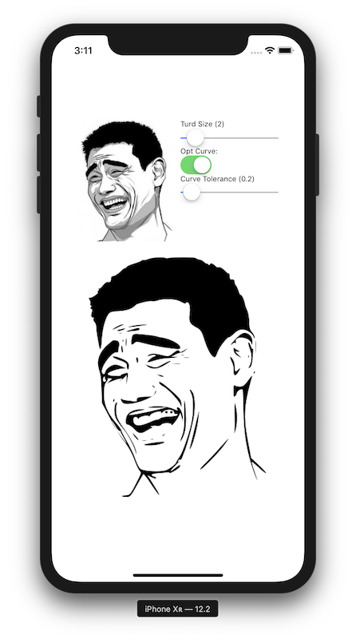

# Swift Potrace

This is a Swift 5.0 compatible port of the [JavaScript port](https://github.com/kilobtye/potrace) of [Potrace](http://potrace.sourceforge.net). Potrace allows you to transform a bitmap into a smooth, scalable vector image.

It includes a getBezierPath() function that returns a UIBezierPath for easy rendering on iOS (see included demo app).

```swift
func getBezierPath(scale size: Double = 1.0) -> UIBezierPath
```



Licensed under GPL v2.
Ditsributed without any waranty.
